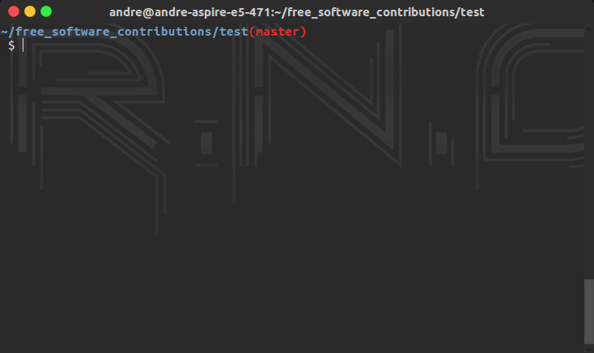
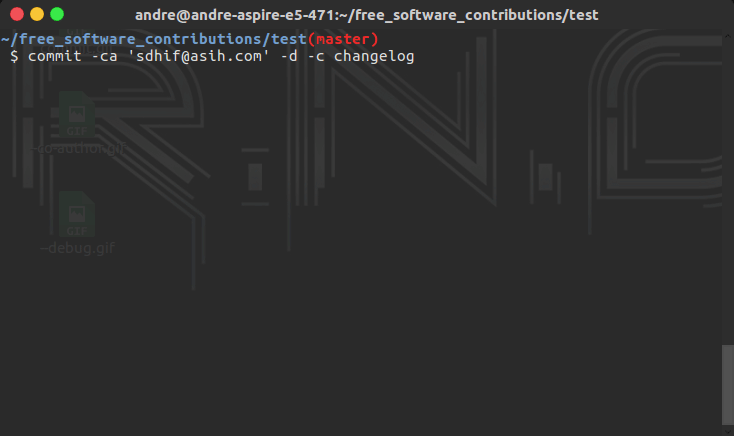
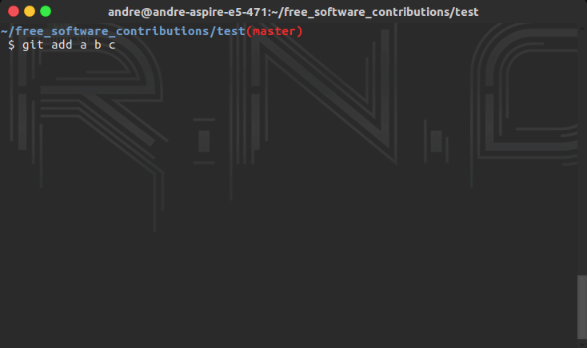
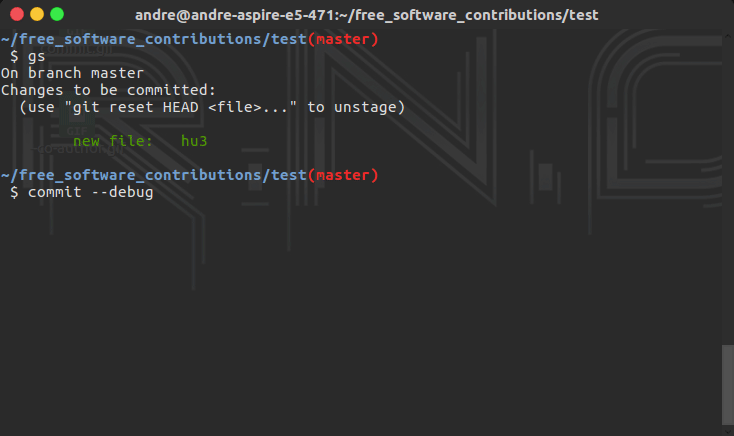
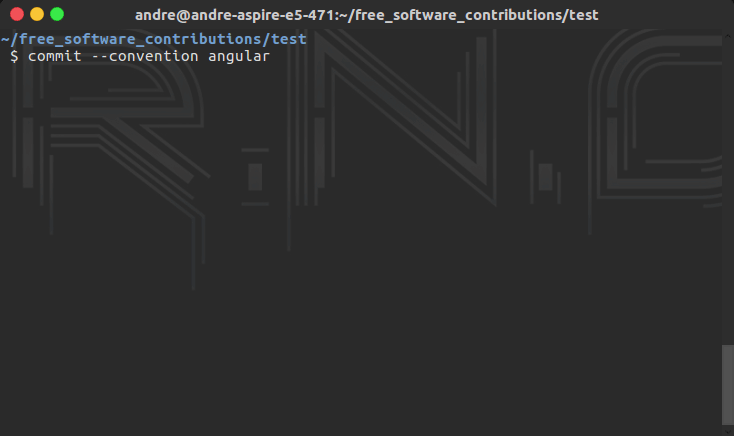

<p align="center">
  
  <h1 align="center">Commit Helper</h3>
</p>

<p align="center">
  <a href="https://travis-ci.org/andre-filho/commit-helper">
    
  </a>
  <a href="https://codeclimate.com/github/andre-filho/commit-helper/maintainability">
    
  </a>
  <a href="https://codebeat.co/projects/github-com-andre-filho-commit-helper-master"></a>
  <a href="https://www.codacy.com/app/andre-filho/commit-helper?utm_source=github.com&amp;utm_medium=referral&amp;utm_content=andre-filho/commit-helper&amp;utm_campaign=Badge_Grade">
    
  </a>
  <a href="https://codeclimate.com/github/andre-filho/commit-helper/test_coverage"></a>

</p>

## What does it do?
The commit-helper do exactly what it's name suggest: helps you create and maintain your commit policy by tailoring your commit message into a commit convention.

## Why should I use this?
Keeping a commit policy may sound like an easy thing to do, but in reality we both know that it isn't.

Sometimes we, the developers, go _full-loco_ while programming and make mistakes when commiting. That's fine, everyone makes mistakes. But, what if those mistakes could be avoided?

## Screenshots

<div style="margin-right:auto;margin-left:auto;">
	
    
    
    
    
    
</div>


## Installation

In order to install one of our older versions, check our [previous releases](PREVIOUS_VERSIONS). To install the latest (pip) version, just follow the commands below:

```bash
$ pip3 install commit-helper
```

## Usage and configuration

This program has a cli that you can take advantage of. Running `commit --help`
will show you the usage and options for your commit. All of them are optional
for the sake of not losing your precious time.

```bash
  $ commit -h
  usage: generator.py [-h] [--co-author CO_AUTHOR] [--no-generate NO_FILE]
                    [--convention {angular,changelog,symphony,message}]

  A commit formatter tool to help you follow commit conventions.

  optional arguments:
    -h, --help            show this help message and exit
    -ca, --co-author CO_AUTHOR
                          make your friend an co-author to the commit
    -nf, --no-file
                          disables the creation of a commiter.yml file
    -c, --convention {angular,changelog,symphony,message}
                          Selects a convention to be used for the commit.
                          Required if there is no commiter.yml file.
```

So, if you want to write a co-authored commit, you should use:

```bash
$ commit --co-author "foo bar doritous <foobar@douritos.com>"
```

Or if you are using this for the first time in your project:

```bash
$ commit --convention changelog
```

To work even more smoothly, have in your working directory a file named **commiter.yml**. In this file you must pass the commit convention that you want to use, following the example:

```yaml
convention: angular   # tag(context): commit message

# or

convention: karma   # tag(context): commit message

# or

convention: changelog # TAG: commit message

# or

convention: symphony  # [Tag] commit message

# and if you're feeling adventurous

convention: none      # Commit message
```

In case that you or your organization does already have a commit convention that is not listed above, you can configure it in the commiter.yml file as following:

```yaml
convention: custom
# considering a commit message like '{add} (stuff) ~> in file foo.br'
commit_pattern: '{tag} (context) ~> message'
# tag, message and context are reserved words that will be replaced in your commit message
context: true # this is a must have field! If your pattern doesn't have one, assign false to it
```

Supported conventions available:

 - angular
 - karma
 - changelog
 - symphony
 - a custom one that you may invent ;)

 ## Troubleshooting
 If after you've installed commit-helper the `commit` or `commit-helper` commands are not usable at the command line, check if `$HOME/.local/bin` is on your PATH. If not, add it on your .bashrc file by running:
 ``` bash
$ echo "export PATH=$HOME/.local/bin:$PATH" >> .bashrc
 ```

## Project's maintainers
| **Name** | **Username** |
| :--------: | :-----: |
| André de Sousa Costa Filho | @andre-filho |

## Our collaborators
| **Name** | **Username** |
| :------: | :----------: |
| Arthur José Benedito de Oliveira Assis | @arthur0496 |
| Matheus Richard Torres Gomes de Melo | @MatheusRich |
